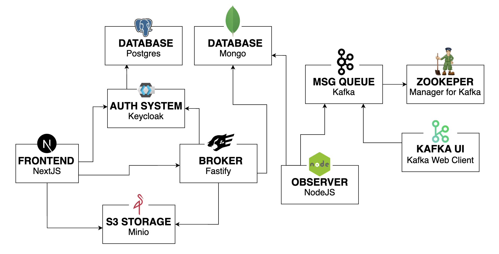

# MJM Cloud Computing Project
The "MJM Cloud Computing Project" is a cloud-based solution that provides several components for various purposes. The deployment diagram is depicted in the image below.

---

## **Online demo**
The online demo is available at:
- Frontend https://web.vera.kumori.cloud
- Broker https://server.vera.kumori.cloud
- Keycloak https://auth.vera.kumori.cloud
- KafkaUI https://kafkauiweb.vera.kumori.cloud

---

## **FRONTEND**

The Frontend section is a simple website that is built using the NextJS framework. The website is composed of 3 pages:
- Home: displays a login button and a background image
- Login: a simple form for users to log in
- Profile: a page where users can change the observer job settings, upload a new background image, and check their authentication connection

The Frontend communicates with Keycloak to authenticate users and receive an auth bearer token, which is then used for authentication communication with the broker.

## **AUTH SYSTEM**
The Auth System section utilizes Keycloak, a widely-used open-source identity and access management service. It is connected to a dedicated Postgres database instance, ensuring the secure storage of sensitive user information.

## **BROKER**
The Broker section is a Fastify server that provides several APIs, including:

- GET /: a simple endpoint to check if the server is working
- POST /auth/check-user: verifies the validity of the bearer token and returns the user's information
- POST /auth/change-observer-settings: changes the observer job settings based on the user's inputs
- POST /auth/upload-background: receives an image and uploads it to Minio, a S3 object storage service

## **S3 STORAGE**
The S3 Storage section uses Minio, a high-performance object storage service that is compatible with Amazon S3 APIs. This service is used to store and manage large amounts of unstructured data such as images, videos, and documents.

## **MESSAGE QUEUE**
The Message Queue section is powered by Kafka, a distributed, high-throughput, and scalable messaging system. The solution also includes the use of Zookeeper, which is used to coordinate and manage Kafka clusters.

## **KAFKA UI**
The Kafka UI section is a service that provides an easy-to-use interface for interacting with the Kafka broker. This section simplifies the process of sending and receiving messages from the Kafka broker, making it more accessible for users with limited technical knowledge.

## **OBSERVER**
The Observer section is a service that performs a defined job, which involves string manipulation. This job is executed with several features that are fetched from a MongoDB database. The available features include:
- Uppercase/lowercase conversion
- String reversal
- Addition of a pre-string
- Addition of a post-string
---

Overall, the MJM Cloud Computing Project is a comprehensive solution that provides several cloud-based components to meet various needs and requirements.
